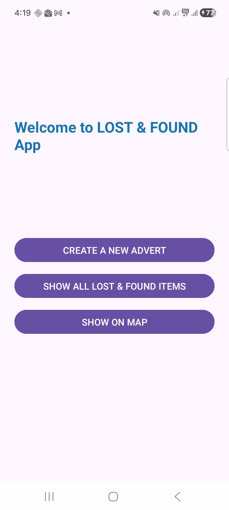
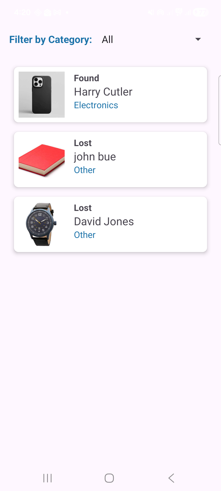
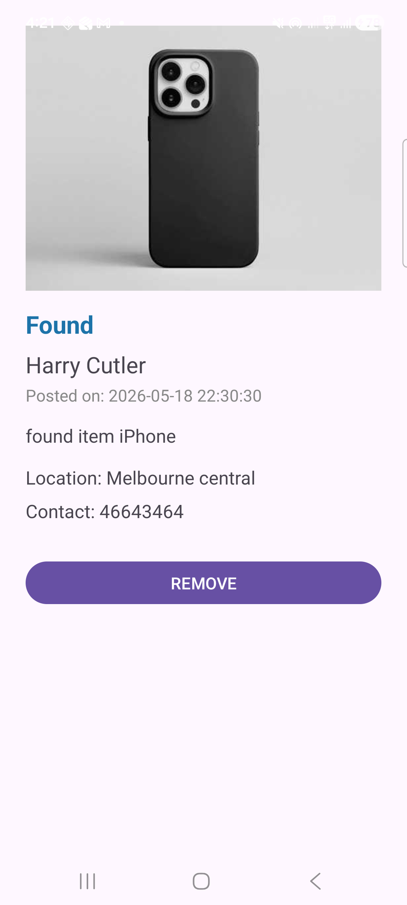
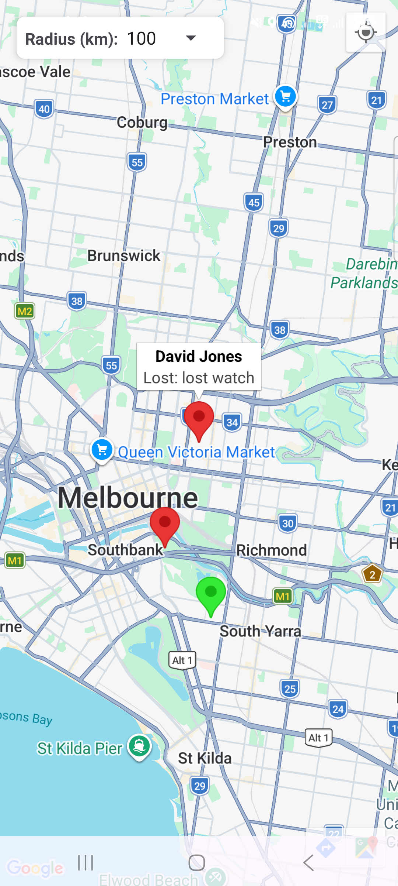
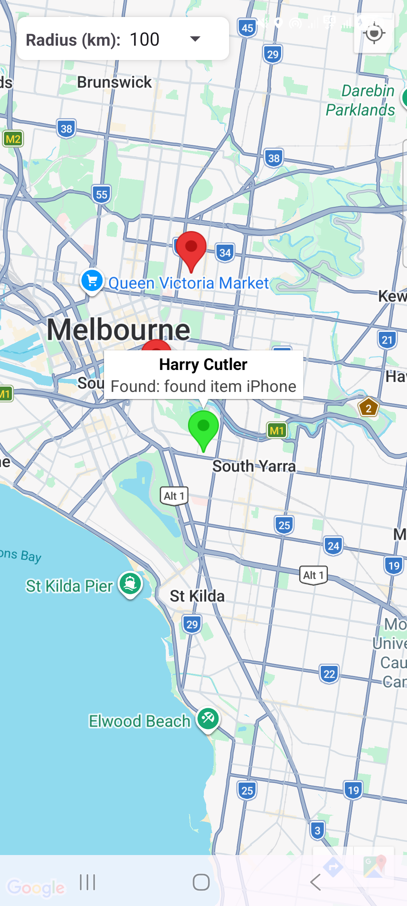

# Lost & Found Map Mobile App

This modern Android app that is built on Java that show a list of lost and found items. Users can locate any items lost or found on the map to determine the correct location of the item. Its the project task for SIT708 Task 9.1P

## Getting Started

### Prerequisites
- Android Studio Panda 2 or newer

### API Key
- Input Google Map API keys in the Manifest & Fragment activity

### Steps
1. Clone the repository
2. Open in Android Studio
3. Sync project with Gradle files
4. Run on device or emulator

### Screenshots

## Tech Stack
- Java
- XML

## Contributing
To be confirmed for pull requests

## License
MIT
